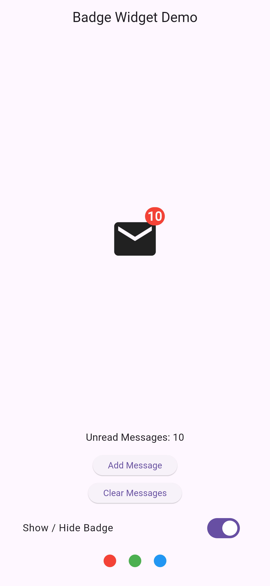

# Badge Widget Demo 

## Description

This project is a simple Flutter demo that showcases the Badge widget using a real-world use case: displaying unread email notifications on a mail icon. Badges are commonly used in messaging, email, and social media apps to show important status information at a glance.

## Real-World Scenario

In many production apps like email or chat applications, a small number appears on an icon to indicate unread messages.
This demo recreates that behavior using Flutter’s Badge widget by showing the number of unread messages on a mail icon.

## How to Run the App

Make sure Flutter is installed on your machine.

```
cd badge_widget

flutter pub get

flutter run
```

## Project Structure

```

lib/
 └── main.dart
 ```

## Badge Properties

This demo focuses on exactly three Badge properties:

### 1, label

Displays the content inside the badge

In this app, it shows the number of unread messages

Without a label, the badge appears as a small dot

### 2, isLabelVisible

Controls whether the badge is shown or hidden

Used to simulate enabling or disabling notifications

Toggled using a switch in the UI

### 3,backgroundColor

Changes the color of the badge

Used to represent different priorities (e.g., red for urgent messages)

Can be changed dynamically using color buttons

## Screenshot


